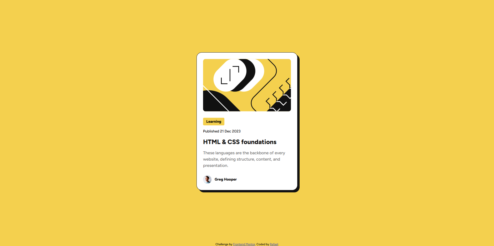

# Frontend Mentor - Blog preview card solution

This is a solution to the [Blog preview card challenge on Frontend Mentor](https://www.frontendmentor.io/challenges/blog-preview-card-ckPaj01IcS). Frontend Mentor challenges help you improve your coding skills by building realistic projects. 

## Table of contents

- [Overview](#overview)
  - [The challenge](#the-challenge)
  - [Screenshot](#screenshot)
  - [Links](#links)
- [My process](#my-process)
  - [Built with](#built-with)
  - [What I learned](#what-i-learned)
  - [Continued development](#continued-development)
  - [Useful resources](#useful-resources)
  - [AI Collaboration](#ai-collaboration)
- [Author](#author)

## Overview

### The challenge

Users should be able to:

- See hover and focus states for all interactive elements on the page

### Screenshot



### Links

- Solution URL: [GitHub repo](https://github.com/0rafae1/blog-preview-card)
- Live Site URL: [Live Preview](https://0rafae1.github.io/blog-preview-card/)

## My process

### Built with

- Semantic HTML5 markup
- CSS custom properties
- BEM methodology
- Flexbox
- Variable fonts

### What I learned

I learned how to structure CSS variables in two layers, primitives and semantics, separating what a color is from what it does, making future maintenance more predictable.

I also learned how to apply the BEM methodology to name classes in a semantic and scalable way:

```html
<article class="blog-card">
  <div class="blog-card__body">
    <div class="blog-card__content">
      <a href="#" class="blog-card__category">Learning</a>
    </div>
  </div>
  <a href="#" class="blog-card__author">...</a>
</article>
```

```css
:root {
  --color-primary: hsl(47, 88%, 63%);
  --color-page-bg: var(--color-primary);
  --color-category: var(--color-primary);
}
```

### Continued development

- Improve my understanding of accessibility, including aria-labels, roles and keyboard navigation
- Learn how to build more robust design systems with well-defined tokens
- Practice mobile-first workflow in upcoming projects

### Useful resources

- [MDN CSS Custom Properties](https://developer.mozilla.org/en-US/docs/Web/CSS/Using_CSS_custom_properties) - Main reference for understanding CSS variables and how to structure them in layers
- [BEM Methodology](https://getbem.com) - Official BEM documentation, essential for understanding the class naming logic


### AI Collaboration

I used Claude as a structured pair programming assistant, focused on learning rather than generating solutions.

The AI focused on:

- Explaining concepts and reasoning
- Guiding problem-solving through hints and questions
- Reviewing decisions only after my own implementation

All code was written and reviewed by me, using AI strictly as a learning support tool.

## Author

- LinkedIn - [Rafael Sousa](https://www.linkedin.com/in/orafael-sousa)
- Frontend Mentor - [@0rafae1](https://www.frontendmentor.io/profile/0rafae1)
- Outlook - [E-mail](mailto:rafaeltowork@outlook.com)
